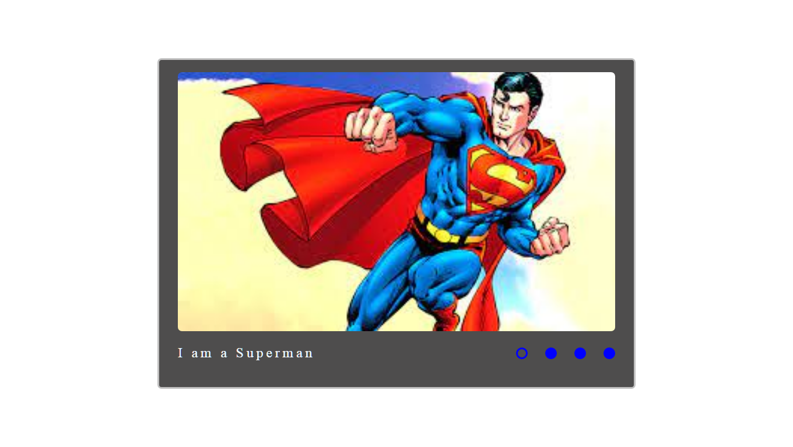
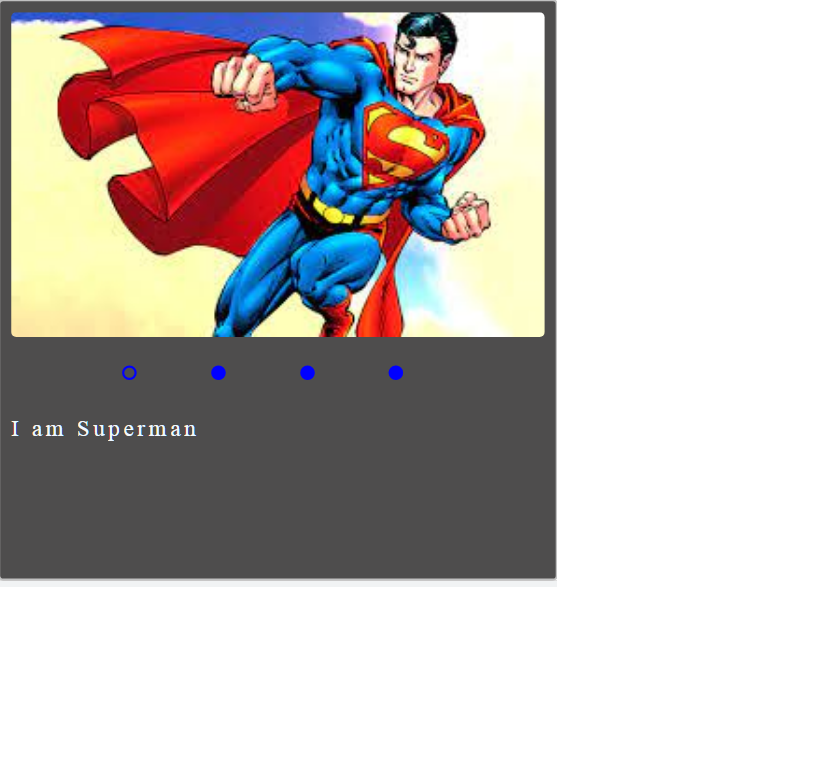

# cssMemSlider

1. Task: https://github.com/rolling-scopes-school/tasks/tree/master/tasks/css-mem-slider#readme
2. Screenshot:
   Desctop:
   
   Mobil:
   
3. Deploy: https://Piotr-reader.github.io/cssMemSlider/cssMemSlider/
4. Done 08.05.2022 / deadline 17.05.2022
5. Score: 150 / 150

- Выполнено всё из секции Требования к репозиторию
- Слайдер позиционируется с равными отступами слева и справа
- Соблюдено расположение картинок, подписей к ним и контролов
- Имеется анимация для смены картинок
- Имеется анимация для смены подписей к картинкам
- Подписи к картинкам строковые значения (текст)
- Каждый контрол имеет большую область нажатия, чем размер самого контрола
- Контролы имеют интерактивность (момент наведения, момент нажатия, активный контрол, изменение курсора)
- Имеется мобилная версия слайдера и соблюдено расположение картинок, подписей к ним и контролов (мобильная версия <768px, версия для ПК >=768px)
- Используются относительные едициы измерения для основных блоков (картинки, контролы, подписи) (rem, em, %, vh, vw, fr and etc... ) - присутствует "резиновость" слайдера
- Все блоки/составные части слайдера (контролы, картинки, подписи к слайдеру) находятся в базовом потоке дом-элементов, не позиционируются с помощью top, left, right, bottom. Не используются псевдоэлементы.
